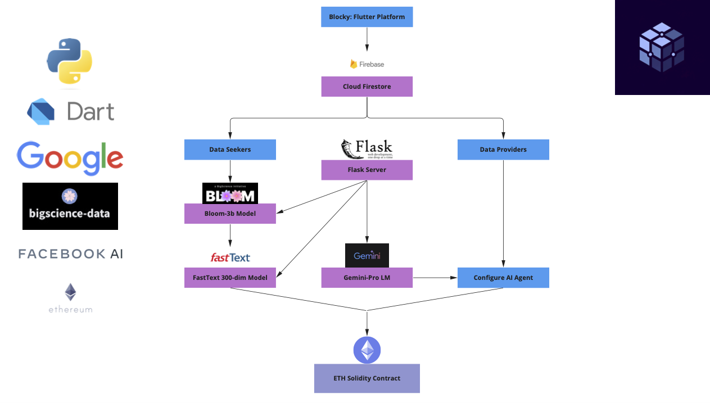

  
   

# Blocky
Blocky is an innovative platform that seamlessly connects data seekers with data providers through the strategic use of AI-powered autonomous agents and NLP models. Through negotiations with these AI agents, ETH solidity smart contracts are drafted to facilitate secure transactions of data. Blocky allows for data seekers to find data providers to acquire hyper niche and specific custom data: writing samples, graphic designs, videos, music, datasets.

Blocky uses a fine-tuned bloom-3b model, as well as a 300-dimensional vector space model, to match data seekers with the most suitable data providers. Integrated with the Google Gemini API, data providers can configure their AI agents to negotiate with data seekers, for the purpose of drafting ETH smart contracts. This ensures all transactions are not only secure and transparent, but also compliant with prevailing legal standards.

The tech stack includes:
  1) Flutter: Dart
  2) Flask: Python backend server
  3) Firebase database
  4) bloom-3b LM
  5) FastText VS model
  6) Gemini-Pro LM
  7) Solidity smart contracts
